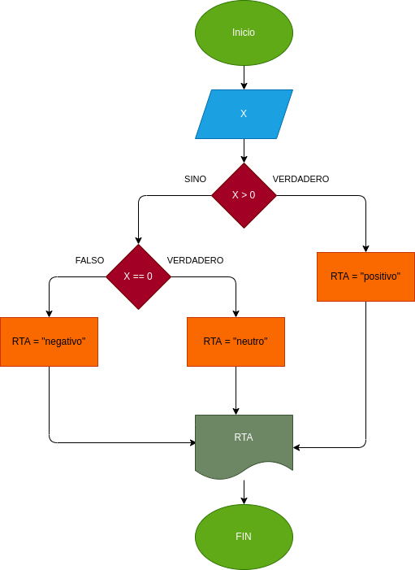

## Positivo_Negativo
programa para verificar si un numero es positivo o negativo

# crear un programa para verificar si un numero es par o impar
# analisis

-variables de entrada

X : numero ingresado

-variables de salida

RTA : nos va a decir si es positivo o negativo
# Diseño

# CONSTRUCCION

ejecicio n.5 Implemetar un porgramar que verifique si un numero es positivo o negativo

usamso lo comparadores para determinar si es positivo o negativo
if x > 0
elif x == 0

## ESTE ARCHIVO ESTA ESCRITO NE LENGUAJE MARKDOWN
